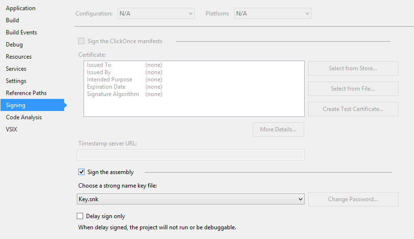
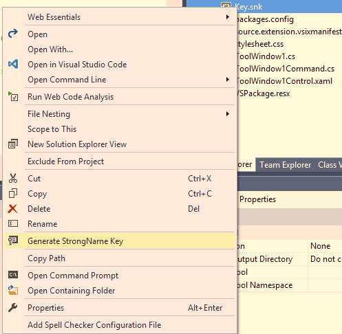
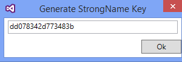

# StrongNameKeyGenerator

<!-- Replace this badge with your own-->

<!-- Update the VS Gallery link after you upload the VSIX-->
Download this extension from the [VS Gallery](https://visualstudiogallery.msdn.microsoft.com/[GuidFromGallery])
or get the [CI build](http://vsixgallery.com/extension/0b0faa84-d117-4045-a28c-47893493f73c/).

---------------------------------------

Extracts public key from key-pair without the need of using command prompt.

strong name provides a strong integrity check, By strongly naming your VSIX project, 
you are assured that your binary has not been tampered with since it was compiled or built.

Before strong name signing an assembly,there is the need to generate a public or private key-pair, 
and the .NETFramework SDK provides tools for assigning a cryptographic signature to any built assembly. 

The first step in strongname signing is generating a key-pair. The sn.exe tool is located 
in "C:\Program Files\Microsoft Visual Studio 8\SDK\v2.0\Bin\" and is a cmd tool, 
or more preferable through Microsoft Visual Studio IDE via project’s properties.
This option generates key-pairs and sign assemblies without the need to create a key-pair using Sn.exe
    - click on signing tab, 
    - check "Sign the assembly" then browse to the .snk file:

See the [changelog](CHANGELOG.md) for changes and roadmap.

## Features

- Extracts public key from key-pair for VSIX related projects

.   Right click on your Key-pair

.   Select "generate StrongName Key"

- The tool uses "sn -k keypair.snk" to create a key-pair
- And "sn -p keypair.snk public.snk" to extract the public key from the key-pair 

Then copy the key and paste to your desired location.

## Contribute
Check out the [contribution guidelines](CONTRIBUTING.md)
if you want to contribute to this project.

For cloning and building this project yourself, make sure
to install the
[Extensibility Tools 2015](https://visualstudiogallery.msdn.microsoft.com/ab39a092-1343-46e2-b0f1-6a3f91155aa6)
extension for Visual Studio which enables some features
used by this project.

## License
[Apache 2.0](LICENSE)